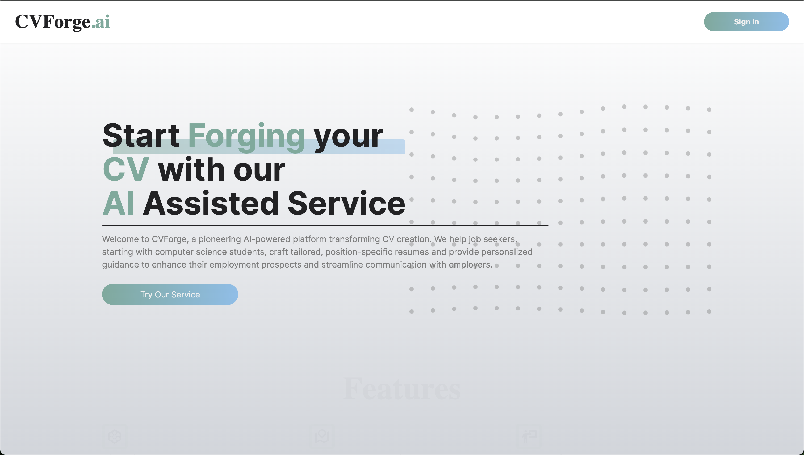
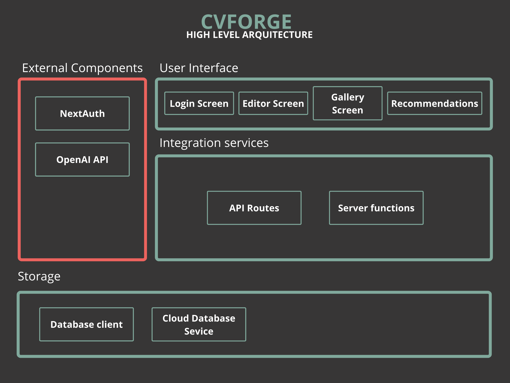
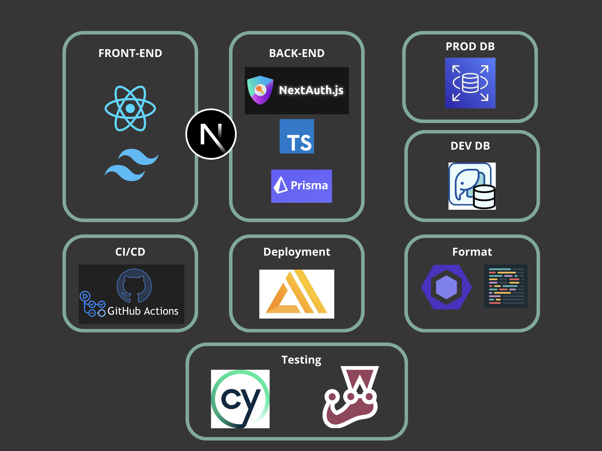

<a name="readme-top"></a>

<!-- PROJECT LOGO -->
<br />
<div align="center">
<br>
  <a href="https://github.com/othneildrew/Best-README-Template">
    
  </a>

  <p align="center">
    Start Forging your CV with our AI Assisted Service 
  </p>
  <br />
  <a href="https://main.d1q8p2sw9urkoh.amplifyapp.com/">Visit Site</a>
</div>

<!-- TABLE OF CONTENTS-->
<details>
  <summary>Table of Contents</summary>
  <ol>
    <li><a href="#about-the-project">About The Project</a></li>
    <li><a href="#stack">Stack</a></li>
    <li><a href="#architecture-diagram">Architecture Diagram</a></li>
    <li><a href="#setup">Setup</a></li>
    <li><a href="#usage">Usage</a></li>
    <li><a href="#features">Features</a></li>
    <li><a href="#contributing">Contributing</a></li>
    <li><a href="#license">License</a></li>
    <li><a href="#contact-us">Contact Us</a></li>
  </ol>
</details>

<!-- ABOUT THE PROJECT -->

## About The Project

<div align="center">
  
</div>


CVForge.ai is a SaaS that helps users create a CV suitable for the position they want to apply for with the help of AI. This application uses our database to search for CVs that were accepted for the desired position by the user and utilizes the information provided by the user via uploading their CV, linking their LinkedIn account, or entering their information manually. CVForge.ai uses artificial intelligence to generate a CV tailored to the specific position the user wishes to apply for. Additionally, it provides feedback on the generated CV, helping the user improve their presentation. GPT and LinkedIn APIs are used.

## Stack

- [![Next][Next.js]][Next-url]
- [![Node][Node.js]][Node-url]
- [![React][React.js]][React-url]
- [![PostgreSQL][Postgre.sql]][Postgre-url]
- [![Tailwind][Tailwind.ts]][Tailwind-url]
- [![Prisma][Prisma.io]][Prisma-url]
- [![OpenAI][Openai.ai]][Openai-url]
- [![AWS][Aws.ts]][Aws-url]
- [![GitHub][Github.ts]][Github-url]
- [![Cypress][Cypress.io]][Cypress-url]
- [![Jest][Jest.io]][Jest-url]

<p align="right">(<a href="#readme-top">back to top</a>)</p>

## Architecture Diagram

<div align="center">
  
</div>

## Diagram of Used Technologies 

<div align="center">
  
</div>

<!-- GETTING STARTED -->

## Setup
### Prerequisites

Have Node installed on your hardware.
To verify Node is installed, run the following command in your terminal:
```bash
npm -v
```

### Installation

To install the project, follow these steps:

Clone the repository
```bash
git clone https://github.com/wizelineacademy/itesm-socioformador-feb-jun-2024-CVForge.git
cd itesm-socioformador-feb-jun-2024-CVForge
```

Install all dependencies
```bash
npm i
```

### Create .env

Create a .env file in the root of the project and add the following environment variables.
```bash
AUTH_SECRET=<YOUR_KEY>
POSTGRES_URL=<YOUR_KEY>
DATABASE_URL=<your_database_url>
GOOGLE_CLIENT_ID=<your_google_client_id>
GOOGLE_CLIENT_SECRET=<your_google_client_secret>
NEXTAUTH_URL=<your_nextauth_url>
NEXTAUTH_SECRET=<your_nextauth_secret>
JWT_SECRET=<your_jwt_secret>
OPENAI_API_KEY=<your_openai_api_key>
NODE_TLS_REJECT_UNAUTHORIZED=<value> # e.g., 0
NEXT_PUBLIC_TINYMCE_API_KEY=<your_tinymce_api_key>
LINKEDIN_CLIENT_ID=<your_linkedin_client_id>
LINKEDIN_CLIENT_SECRET=<your_linkedin_client_secret>
```
<p align="right">(<a href="#readme-top">back to top</a>)</p>

<!-- USAGE -->

## Usage

To start the development server, run:
```bash
npm run dev
```

<!-- FEATURES -->

## Features
<ul>
  <li>AI-assisted CV generation
  <li>Integration with LinkedIn
  <li>Feedback on CV quality
  <li>Database of successful CVs for reference
  <li>Secure user data management
</ul>
<!-- CONTRIBUTING -->

## Contributing

Contributions are what make the open-source community such an amazing place to learn, inspire, and create. Any contributions you make are greatly appreciated.

If you have a suggestion that would make this better, please fork the repo and create a pull request. You can also simply open an issue with the tag "enhancement".
Don't forget to give the project a star! Thanks again!

<ol>
  <li>Fork the Project
  <li>Create your Feature Branch (git checkout -b feature/AmazingFeature)
  <li>Commit your Changes (git commit -m 'Add some AmazingFeature')
  <li>Push to the Branch (git push origin feature/AmazingFeature)
  <li>Open a Pull Request
</ol>

<!-- CONTACT -->

## Contact Us

LinkedIn: [CVForge](https://www.linkedin.com/company/cvforge/about/) 

Project Link: [https://github.com/wizelineacademy/itesm-socioformador-feb-jun-2024-CVForge](https://github.com/wizelineacademy/itesm-socioformador-feb-jun-2024-CVForge)

<p align="right">(<a href="#readme-top">back to top</a>)</p>

<!-- Contributors -->

## Contributors

We want to extend a big thank you to all of our contributors. Your support and contributions make this project possible!

<table style="border-collapse: collapse; width: 100%;">
  <tr style="border: none;">
    <td><a href="https://github.com/Lebrijay02">@Lebrijay02</a></td>
    <td><a href="https://github.com/marcopod">@marcopod</a></td>
    <td><a href="https://github.com/Peco1503">@Peco1503</a></td>
  </tr>
  <tr style="border: none;">
    <td><a href="https://github.com/AngelGaelGarciaRangel">@AngelGaelGarciaRangel</a></td>
    <td><a href="https://github.com/YuvanTec">@YuvanTec</a></td>
    <td><a href="https://github.com/a01721732">@a01721732</a></td>
  </tr>
</table>

<p align="right">(<a href="#readme-top">back to top</a>)</p>

[Next.js]: https://img.shields.io/badge/next.js-000000?style=for-the-badge&logo=nextdotjs&logoColor=white
[Next-url]: https://nextjs.org/
[Node.js]: https://img.shields.io/badge/Node.js-10141c?logo=node.js&logoColor=5FA04E&style=for-the-badge
[Node-url]: https://nodejs.org/en
[React.js]: https://img.shields.io/badge/React-20232A?style=for-the-badge&logo=react&logoColor=61DAFB
[React-url]: https://reactjs.org/
[Postgre.sql]: https://img.shields.io/badge/-Postgre-282424?logo=postgresql&logoColor=4169E1&style=for-the-badge
[Postgre-url]: https://www.postgresql.org
[Tailwind.ts]: https://img.shields.io/badge/-Tailwind-0b1120?logo=tailwind%20css&logoColor=06B6D4&style=for-the-badge
[Tailwind-url]: https://tailwindcss.com
[Prisma.io]: https://img.shields.io/badge/-Prisma-090a15?logo=prisma&logoColor=white&style=for-the-badge
[Prisma-url]: https://www.prisma.io
[Openai.ai]: https://img.shields.io/badge/-Open%20ai-black?logo=openai&logoColor=412991&style=for-the-badge
[Openai-url]: https://openai.com
[Aws.ts]: https://img.shields.io/badge/-AWS-222f3e?logo=aws%20lambda&logoColor=FF9900&style=for-the-badge
[Aws-url]: https://aws.amazon.com
[Github.ts]: https://img.shields.io/badge/-Github-181717?logo=github&logoColor=white&style=for-the-badge
[Github-url]: https://github.com
[Cypress.io]: https://img.shields.io/badge/-Cypress-white?logo=cypress&logoColor=69D3A7&style=for-the-badge
[Cypress-url]: https://www.cypress.io
[Jest.io]: https://img.shields.io/badge/-jest-C21325?logo=jest&logoColor=white&style=for-the-badge
[Jest-url]: https://jestjs.io
 